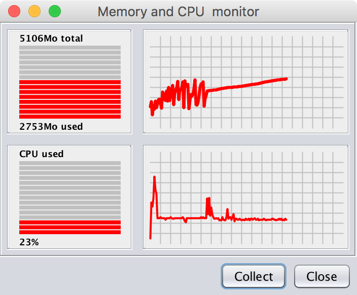

# JResourcesMonitor

A simple GUI that tracks and displays memory and CPU usage of the current
running JVM. Can be simply embedded in a java application calling 
"new JResourcesMonitor();"

 
The code is inspired from Apache Batik's "MemoryMonitor", but is rewritten 
in order not to rely any external library.
  
Java 7 or later is needed
